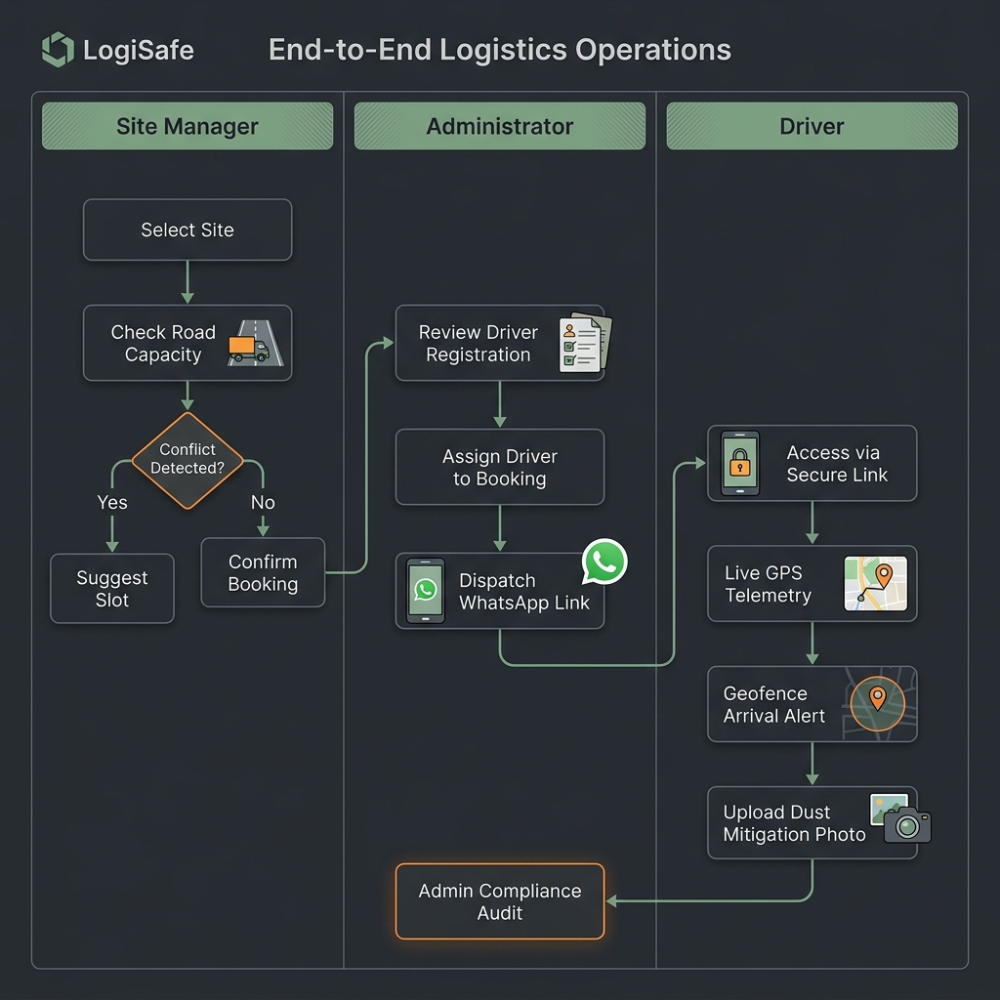
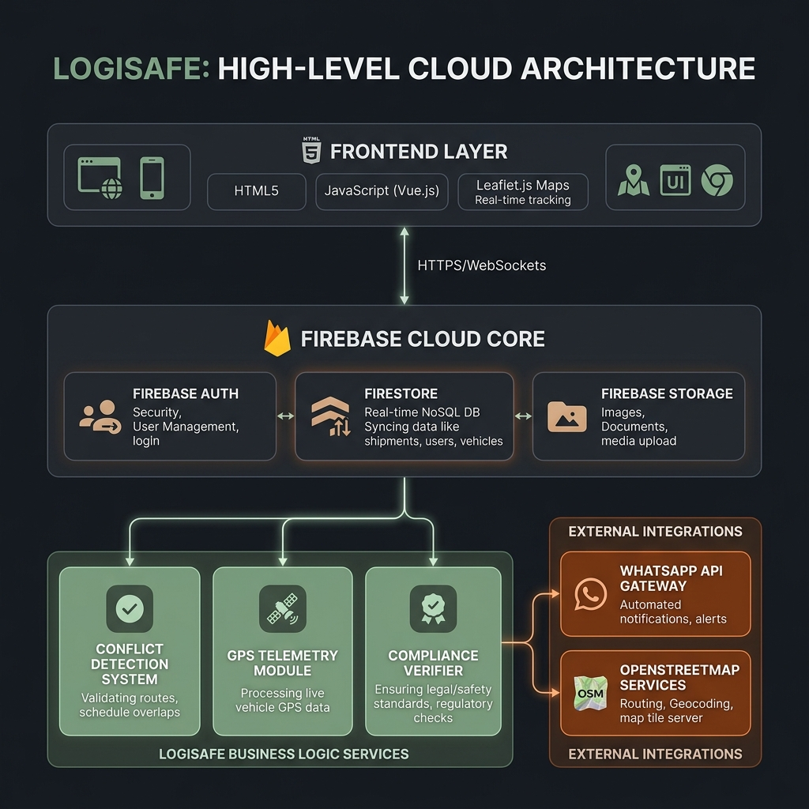

# 🏗️ LogiSafe

**Smart Construction Logistics Platform for MBMC Mira-Bhayandar**

LogiSafe is a premium, corporate-grade logistics management platform designed to streamline construction material transport, ensure driver compliance, and provide real-time visibility into logistics operations.

---

## 📸 System Overview

### 🔄 Operational Workflow


### 🏗️ System Architecture


---

## ✨ Key Features

-   **Verified-Driver-First Auth**: Secure authentication gate for drivers with profile verification.
-   **Real-Time Tracking**: Live GPS monitoring of material transport via temporary, expiring links.
-   **Smart Booking**: Slot-based request system for construction materials.
-   **Geofencing & Compliance**: Automated tracking of arrivals and departures with photo verification.
-   **Admin Dashboard**: Centralized control for managing sites, drivers, and trip approvals.

## 🛠️ Tech Stack

-   **Frontend**: HTML5, Vanilla CSS, JavaScript (Vite-ready)
-   **Backend/Database**: Firebase (Firestore, Auth, Storage)
-   **Maps**: Google Maps Platform API
-   **Deployment**: Vercel / Firebase Hosting

## 🚀 Getting Started

1.  **Clone the repository**:
    ```bash
    git clone https://github.com/Sakshax/LogiSafe.git
    ```
2.  **Install dependencies**:
    ```bash
    npm install
    ```
3.  **Run locally**:
    ```bash
    npm run dev
    ```

## 📂 Project Structure

```text
logi-safe/
├── assets/             # Icons and Images
├── scripts/            # Utility and Build Scripts
├── src/                # Core Application Logic
├── index.html          # Main Entry Point
├── firebase.json       # Firebase Configuration
└── package.json        # Dependencies and Scripts
```

---

*LogiSafe — Ensuring Transparency and Efficiency in Construction Logistics.*