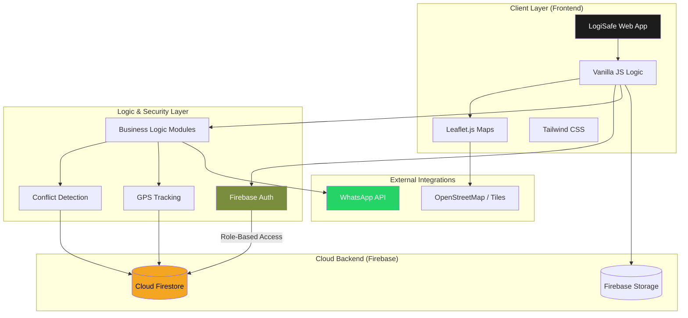

# LogiSafe System Architecture

This document describes the technical architecture and data flow of the LogiSafe platform.

## Architectural Components

### 1. Presentation Layer
- **Vanilla JavaScript Orchestration**: Handles view life-cycles and real-time UI updates without the overhead of heavy frameworks.
- **Leaflet.js & OSM**: Provides high-performance map rendering and dynamic marker management for live tracking.

### 2. Backend-as-a-Service (Firebase Core)
- **Cloud Firestore**: A NoSQL real-time database that enables sub-second latency for GPS tracking and booking updates.
- **Role-Based Authentication**: Manages secure access tokens for Admins, Managers, and Drivers.
- **Firebase Storage**: Stores compliance images (dust mitigation photos) with secure, time-limited access URLs.

### 3. Logic & Modules
- **Conflict Detection Engine**: Analyzes road capacity and suggests optimal delivery windows.
- **Telemetry System**: Manages high-frequency GPS coordinate streams and geofence triggering.
- **Compliance Auditor**: Automates the association of photos with specific delivery slots for verification.

### 4. External Integrations
- **WhatsApp Integration**: Uses `wa.me` API for frictionless dispatch of secure tracking links to driver mobile devices.
- **Reverse Geocoding**: Utilizes the Nominatim API to translate GPS pins into human-readable delivery addresses.
