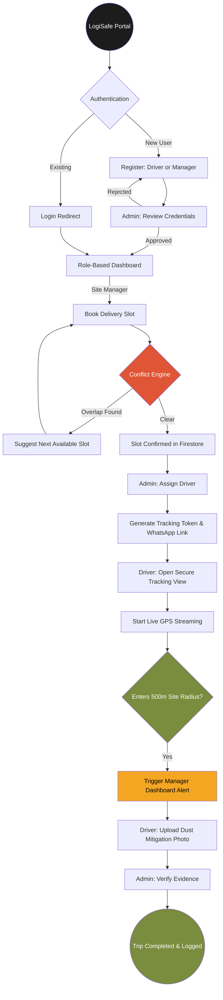

# LogiSafe Operational Workflow

This diagram illustrates the lifecycle of a delivery within the LogiSafe platform, detailing the interactions between Admins, Managers, and Drivers.

## Workflow Breakdown

### 1. Unified Authentication
Users enter through a shared portal. The system uses **Role-Based Access Control (RBAC)** to ensure that an Admin sees the Global Heatmap, while a Manager sees their specific Site Schedule.

### 2. Intelligent Scheduling
Site Managers use the **Conflict Detection Engine** to prevent road congestion. If a site is at capacity, the system prevents the booking and suggests the nearest free 30-minute window.

### 3. Dispatch & Tracking
Once a slot is confirmed, Admins assign an approved driver. A secure **Tracking Token** is generated, bypassing the need for the driver to log in. This link is sent via WhatsApp for immediate action.

### 4. Proximity & Compliance
When the truck's telemetry enters the **500m Geofence**, the Site Manager receives a visual "Priority Alert." Before unloading, the driver must upload a **Compliance Photo**, which is instantly logged in the Admin’s audit trail for regulatory verification.
